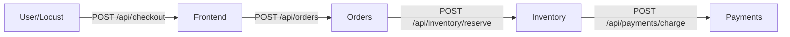

# FlexaScale Demo Microservices Setup

The demo microservices application has been successfully created. This application will act as the target environment for the FlexaScale RL auto-scaling agent.

## Architecture & Components

The application follows a chain architecture to simulate inter-service dependencies, which is critical for demonstrating your agent's ability to model upstream and downstream dependencies.



> [!NOTE]
> Each service has been built with Python 3.11 and **FastAPI**, and is instrumented using `prometheus-fastapi-instrumentator`. This exposes a `/metrics` endpoint on each service by default, allowing Prometheus to easily scrape RPS and latency data.

We created 4 separate directories (`frontend`, `orders`, `inventory`, `payments`), each containing:
- `main.py`: The FastAPI application code.
- `requirements.txt`: Python dependencies (`fastapi`, `uvicorn`, `requests`, `prometheus-fastapi-instrumentator`).
- `Dockerfile`: Instructions for containerizing the service.

## Orchestration

> [!TIP]
> You can run the entire environment locally without Kubernetes using Docker Compose.

- **[docker-compose.yml](file:///home/ghanasyam/Desktop/S7/flexascale/app/docker-compose.yml)**: Created at the root to facilitate local testing and building of all images.
- **[k8s/](file:///home/ghanasyam/Desktop/S7/flexascale/app/k8s/)**: Contains Kubernetes Deployments and Services for each of the microservices. They are pre-configured with standard resource requests and limits (`100m`/`500m` CPU, `128Mi`/`256Mi` RAM).

## Load Simulation

- **[locustfile.py](file:///home/ghanasyam/Desktop/S7/flexascale/app/locust/locustfile.py)**: Contains a Locust load testing script that simulates user checkout flows. This will be used to simulate traffic spikes and test the agent's response time and scaling actions.

## Next Steps

1. To test everything locally:
```bash
cd /home/ghanasyam/Desktop/S7/flexascale/app
docker-compose up --build
```
2. In a separate terminal, to test the load generator:
```bash
cd /home/ghanasyam/Desktop/S7/flexascale/app/locust
locust -f locustfile.py --host=http://localhost:8000
```
3. To deploy to your local Minikube cluster (make sure you push your images to a registry or build them inside minikube):
```bash
kubectl apply -f k8s/
```

## Phase 2: RL Core (PPO Integration)

The Stable-Baselines3 PPO integration is complete, setting up the foundation for the RL agent. Since the actual environment and feature extractor are still under development, we implemented a decoupled architecture using mock components.

### Implementation Details
- **[mock_env.py](file:///home/ghanasyam/Desktop/S7/flexascale2/flexascale/src/flexascale/simulator/mock_env.py)**: A placeholder `gymnasium.Env` that simulates cluster data. It emits synthetic observations matching the `ServiceState` schema (a flat vector of size `num_services * 5`).
- **[mock_extractor.py](file:///home/ghanasyam/Desktop/S7/flexascale2/flexascale/src/flexascale/rl/mock_extractor.py)**: A dummy PyTorch MLP extending SB3's `BaseFeaturesExtractor`. This acts as a drop-in replacement for the pending GNN dependency encoder.
- **[ppo_agent.py](file:///home/ghanasyam/Desktop/S7/flexascale2/flexascale/src/flexascale/rl/ppo_agent.py)**: The `PPOAgentManager` encapsulates the model setup, injecting the custom feature extractor via `policy_kwargs`. It also configures essential callbacks for checkpointing and evaluation.
- **[train.py](file:///home/ghanasyam/Desktop/S7/flexascale2/flexascale/src/flexascale/rl/train.py)**: The entrypoint script that initializes the mock environment and triggers the training loop with TensorBoard logging.

### How to Run the Training Loop
To verify the PPO training pipeline locally (after installing the dependencies):
```bash
PYTHONPATH=src python3 src/flexascale/rl/train.py --timesteps 5000
```
You can monitor the training metrics using TensorBoard:
```bash
tensorboard --logdir=./logs/tb/
```
